<p align="center">
  
</p>

<h1 align="center">МетеоКод</h1>

<p align="center">
  <strong>Исследовательская система для экспериментов с нейросетевым сжатием глобальных полей ERA5, оценкой качества восстановления и визуальным анализом атмосферных данных.</strong>
</p>

<p align="center">
  
  
  
  
  
</p>

«МетеоКод» исследует, какой объём и состав обучающей выборки достаточен для
сжатия многоканальных атмосферных полей в 32–64 раза без потери научно значимой
структуры. Репозиторий объединяет подготовку ERA5, воспроизводимые эксперименты,
codec-контур с реальным bitstream, физические метрики, API артефактов,
интерактивный Three.js-глобус и локальную наблюдаемость.

> [!IMPORTANT]
> Проект находится в статусе исследовательского прототипа. Bundled
> `public/data/results.json`, `demo/mock` и globe demo нужны для проверки
> контрактов и интерфейса; их численные значения не являются итоговыми
> результатами исследования на полном ERA5.

## Содержание

- [О проекте](#о-проекте)
- [Как работает система](#как-работает-система)
- [Возможности](#возможности)
- [Интерактивная визуализация атмосферы](#интерактивная-визуализация-атмосферы)
- [Статус реализации](#статус-реализации)
- [Данные](#данные)
- [ML и codec pipeline](#ml-и-codec-pipeline)
- [Метрики](#метрики)
- [Архитектура](#архитектура)
- [API](#api)
- [Технологии](#технологии)
- [Структура репозитория](#структура-репозитория)
- [Быстрый старт](#быстрый-старт)
- [Запуск исследовательских сценариев](#запуск-исследовательских-сценариев)
- [Конфигурация](#конфигурация)
- [Docker](#docker)
- [Наблюдаемость](#наблюдаемость)
- [Тестирование и качество](#тестирование-и-качество)
- [Типичный сценарий исследователя](#типичный-сценарий-исследователя)
- [Ограничения и следующие этапы](#ограничения-и-следующие-этапы)
- [Документация](#документация)

## О проекте

Глобальные атмосферные архивы содержат большие четырёхмерные массивы:
время × канал × широта × долгота. Даже один временной срез включает поля с
разными физическими единицами, пространственной динамикой и масками валидности.
При обучении codec-модели недостаточно уменьшить число элементов latent:
необходимо получить самостоятельный бинарный поток, декодировать его без
доступа к исходному tensor и измерить ошибку в физических единицах.

«МетеоКод» строится вокруг вопроса:

> Какой минимальный leakage-safe набор временных срезов сохраняет качество
> восстановления ERA5 при заданном бюджете сжатия?

Система разделяет четыре задачи:

1. Подготовить и проверить атмосферные данные, их каналы, единицы, координаты,
   маски и provenance.
2. Обучить или применить compression model на фиксированных временных split.
3. Выполнить полный encode → bitstream → decode и рассчитать физические метрики.
4. Сопоставить результаты по каналам, размерам выборки и коэффициентам сжатия
   через API, dashboard и глобальную визуализацию.

### Исследовательские принципы

| Принцип | Реализация в проекте |
| --- | --- |
| Честный compression accounting | Tensor-element ratio и реальный serialized ratio хранятся как разные метрики. |
| Защита от temporal leakage | Train, validation и test не пересекаются; sample manifest проверяет семидневный embargo перед validation. |
| Train-only normalization | Mean, std и диапазоны вычисляются только по training subset и сохраняются с checksum/provenance. |
| Физическая интерпретация | Ошибки считаются после inverse normalization в исходных единицах каналов. |
| Глобальная геометрия | Пространственные метрики используют cosine latitude weights; SST оценивается с ocean mask. |
| Воспроизводимость | Эксперимент сохраняет config, seed, commit при наличии, checkpoint/bitstream metadata, метрики и runtime. |

## Как работает система

```mermaid
flowchart LR
    A[ERA5 NetCDF или WeatherBench2 Zarr] --> B[Schema validation и manifests]
    B --> C[Temporal splits и sample selection]
    C --> D[Train-only normalization]
    D --> E[PCA / ConvAE / CRA5 adapter]
    E --> F[Latent representation]
    F --> G[Scalar quantization]
    G --> H[Canonical Huffman bitstream]
    H --> I[Decode без исходного tensor]
    I --> J[Inverse normalization]
    J --> K[Physical metrics и artifacts]
    K --> L[FastAPI / Dashboard / Three.js globe]
```



В репозитории есть полный codec smoke-контур с quantization, Huffman coding и
exact roundtrip по квантованным символам. Сейчас он подтверждён на synthetic
данных; обучение ConvAE на полном реальном ERA5 ещё не подключено.

## Возможности

### ERA5 data pipeline

- строгая инспекция и загрузка пары instant/accumulated NetCDF;
- проверка переменных, единиц, координат, timestamps, `expver`, NaN и SST mask;
- безопасная суточная и диапазонная загрузка через CDS с dry-run, staging,
  SHA-256 и resume только для проверенных дней;
- WeatherBench2/Zarr-контур для 28 логических каналов;
- lazy extraction одного поля для API без передачи целого Zarr в браузер;
- nested sample manifests на 16/32/64/128 временных срезов с temporal embargo;
- train-only statistics и проверяемая metadata provenance.

### Compression research

- synthetic PCA autoencoder для быстрого sample-efficiency MVP;
- patch-based PCA baseline для подготовленных 8-канальных NPZ;
- небольшой convolutional autoencoder для 28-канального codec smoke;
- uniform scalar quantization и canonical Huffman coding;
- самостоятельный bitstream с header, channel order, checkpoint hash и
  quantization metadata;
- full-frame и tiled decode из entropy-decoded latent;
- training-only factorized logistic rate proxy, отделённый от реального
  serialized compression ratio;
- экспериментальная адаптация внешнего CRA5-159v checkpoint к 28 каналам.

### Evaluation

- MSE, RMSE и MAE в физических единицах;
- latitude-weighted RMSE/MAE и bias;
- NRMSE относительно train-only standard deviation;
- PSNR с диапазоном, рассчитанным по train;
- per-channel и surface/pressure diagnostics;
- SST ocean mask, контроль NaN/Inf и valid point counts;
- реальные `bitstream_bytes`, bits per value и serialized compression ratio;
- exact quantized-symbol roundtrip;
- отдельный +6h latent probe с persistence baseline.

### Visual analytics

Dashboard имеет hash-маршруты для:

- обзора запуска и интерактивного глобуса;
- критериев допуска;
- зависимости качества от размера выборки;
- rate–distortion;
- метрик по каналам;
- original/reconstruction/error;
- artifact-provided spectral curves;
- latent probe;
- ресурсов эксперимента;
- настроек интерфейса, источника результатов и API.

Frontend читает единый `results.json`, корректно показывает отсутствующие поля
и не подменяет недостающие reconstruction/error случайными изображениями.

## Интерактивная визуализация атмосферы

Three.js-глобус предназначен для пространственной проверки результатов, а не
для декоративного показа Земли. Исследователь может вращать и масштабировать
сферу, выбирать исторический timestamp, канал, pressure level и сетку, а затем
сравнивать структуру исходного и восстановленного поля.

| Режим | Содержание |
| --- | --- |
| Обычная Земля | Blue Marble используется как базовая поверхность. TCC при наличии преобразуется в прозрачность отдельного облачного слоя. Это не спутниковый снимок и не прогноз текущей погоды. |
| Original | Исходное атмосферное поле для выбранного timestamp. Live Zarr API сейчас поддерживает именно этот режим. |
| Reconstruction | Поле после codec pipeline. Доступно для заранее подготовленных manifest assets. |
| Absolute error | Пространственное поле `abs(original - reconstruction)` для того же run, timestamp, канала и сетки. |

Научный кадр состоит из двух независимых ассетов:

- equirectangular PNG-текстура раскрашивает сферу;
- `Float32` little-endian слой или массив из API хранит числа для point
  inspector.

При клике интерфейс находит ближайшую ячейку, учитывает порядок latitude,
диапазон longitude и показывает координаты, индекс, физическое значение,
timestamp и уровень. Дополнительно доступны color legend, fullscreen, reset
camera и autorotation с поддержкой системного `prefers-reduced-motion`.

Подробный manifest и CLI подготовки ассетов описаны в
[docs/GLOBE.md](docs/GLOBE.md).

<!-- Add a current dashboard screenshot here after committing a reviewed image under docs/images/. -->

## Статус реализации

| Контур | Статус | Ограничение |
| --- | --- | --- |
| 8-канальный raw NetCDF loader/downloader | Реализован | Подтверждённый семидневный набор является pipeline pilot, не финальным training corpus. |
| 28-канальный WeatherBench2/Zarr adapter | Реализован для inspect/download/validate/statistics и API demo | Полный dataset не хранится в Git; validated conservative 0.5° remap пока отсутствует. |
| Synthetic PCA MVP | Реализован в коде | Не является результатом на реальном ERA5. |
| Patch PCA baseline | Реализован | Требует подготовленные 8-канальные NPZ и фиксированные splits. |
| ConvAE codec | Реализован как synthetic 28-channel smoke | `train_codec.py` отклоняет real-data training. |
| Quantization + Huffman bitstream | Реализован | Это первый deterministic codec contour, не финальная learned entropy model. |
| Tiled decode | Реализован | Возможный drift на глобальных границах измеряется, а не объявляется нулевым. |
| CRA5 adapter | Экспериментальный | Текущий trainer создаёт synthetic data; checkpoint и отдельный upstream runtime не входят в Git. |
| Experiment ladder | Частично реализован | ConvAE entry в ladder явно возвращает `not implemented`; полноценное сравнение на real data не завершено. |
| Artifact API | Реализован | По умолчанию обслуживает проверяемый `demo/mock`. |
| Live weather API | Реализован для `original` | `reconstructed` и `error` отвечают `501`, пока реальный codec не подключён. |
| React dashboard и глобус | Реализованы | Bundled результаты и часть globe assets демонстрационные. |
| Prometheus/Grafana | Реализованы для локального API | ML run metrics намеренно не экспортируются без подтверждённых артефактов. |

## Данные

В репозитории сосуществуют два data contract с разными назначениями.

### Raw ERA5: 8 каналов

[docs/DATA_CONTRACT.md](docs/DATA_CONTRACT.md) фиксирует строгую схему
суточной пары NetCDF:

| Категория | Каналы |
| --- | --- |
| Wind | `u10`, `v10` |
| Thermodynamics | `t2m`, `sst` |
| Pressure and moisture | `msl`, `tcwv` |
| Clouds and precipitation | `tcc`, `tp1h` |

Raw `tp` переименовывается loader-ом в `tp1h`; `tp6h` из этого источника
молча не создаётся. Native grid имеет `721 × 1440` точек с шагом 0.25°.
Smoke loader может детерминированно взять каждую вторую точку и получить
`361 × 720`; это subsampling, а не interpolation или conservative remapping.

SST сохраняет NaN над сушей. Model tensor может заменить их нулём только
вместе с отдельной ocean mask.

### WeatherBench2: 28 каналов

28-канальный контур использует WeatherBench2 ERA5 Zarr и порядок из
`src/era5_minimum/data/channel_spec.py`.

| Категория | Каналы |
| --- | --- |
| Surface, 8 | `t2m`, `mslp`, `u10`, `v10`, `tp6h`, `sst`, `tcwv`, `tcc` |
| Pressure, 20 | `T`, `U`, `V`, `Z`, `Q` на 1000, 925, 850 и 700 hPa |

Tensor собирается в порядке `[time, channel, latitude, longitude]`. Native
динамические поля остаются `float32`; SST mask хранится отдельно. Конфигурация
объявляет train `2014–2019`, validation `2020` и test `2021`, но эти полные
split не входят в репозиторий.

Локальный `data/era5_28ch_demo` — игнорируемый Git integration dataset из
четырёх timestamp за 2020-01-01. Он подходит для API/globe smoke, но не для
обучения или выводов о достаточном размере выборки.

> [!WARNING]
> Полная 0.25° выборка оценивается примерно в 116 MB на один timestamp до
> Zarr compression. Загрузка многолетнего train требует отдельного решения по
> storage. Команда conservative remap намеренно завершается ошибкой, пока не
> реализованы и не проверены persistent remapping weights.

## ML и codec pipeline

### Model paths

| Path | Назначение | Текущий источник данных |
| --- | --- | --- |
| `PCAAutoencoder` | Быстрый sample-efficiency baseline | Synthetic MVP |
| `PatchPCABaseline` | Patch-based baseline с streaming normalization | Подготовленные 8-channel NPZ |
| `ConvAutoencoder` | Три stride-2 encoder/decoder уровня и configurable latent channels | Synthetic 28-channel codec smoke |
| `Cra5Vaeformer28` | Экспериментальная адаптация CRA5-159v к ERA5-28 | Synthetic adapter training / внешний checkpoint |
| `LatentProbeMLP` | Прогноз latent на +6 часов относительно persistence | Frozen latent pairs, включая smoke path |

### Encode/decode contract

1. Physical tensor нормализуется только сохранёнными train statistics.
2. Encoder создаёт latent representation.
3. Scalar quantizer переводит latent в `int32` symbols.
4. Canonical Huffman coder создаёт entropy payload.
5. Header сохраняет format version, checkpoint SHA-256, channel order,
   quantization step, original/latent shapes и payload size.
6. Decoder восстанавливает symbols из standalone bitstream и проверяет exact
   symbol roundtrip.
7. Dequantized latent декодируется full-frame или tiled.
8. Результат возвращается в физические единицы, после чего считаются метрики.

Factorized logistic entropy model используется только как differentiable rate
proxy во время rate–distortion training. Источником фактического коэффициента
сжатия остаётся размер canonical Huffman bitstream.

### Артефакты воспроизводимости

Codec workflow может сохранять:

- `resolved_config.yaml`;
- checkpoint и его metadata;
- validation/test bitstreams;
- `run_summary.json`;
- `metrics_validation.json`;
- `metrics_per_channel.json`;
- `metrics_per_time.json`;
- `local_evaluation.json`;
- `resource_usage.json`;
- training history и tiled inference report.

Large datasets, checkpoints, bitstreams и generated outputs исключены из Git.

## Метрики

| Метрика | Что показывает |
| --- | --- |
| MSE / RMSE / MAE | Ошибку реконструкции после возврата в физические единицы. |
| Latitude-weighted RMSE / MAE | Глобальную пространственную ошибку без завышенного вклада полярных grid cells. |
| Bias | Систематическое смещение восстановленного поля. |
| NRMSE | RMSE, нормированный на train-only standard deviation канала. |
| PSNR | Отношение train range к reconstruction error; особые случаи возвращают явный status, а не бесконечность. |
| Per-channel metrics | Качество каждого surface и pressure-level поля с сохранением единиц. |
| Tensor compression ratio | Отношение числа элементов input к числу элементов latent; не равно файловому сжатию. |
| Serialized compression ratio | Отношение float32 input bits к полному bitstream, включая header и side information. |
| Bits per value | Реальный размер bitstream на одно исходное значение. |
| Exact roundtrip | Равенство quantized symbols до и после entropy serialization. |
| Latent probe MSE | Качество +6h latent prediction относительно persistence baseline. |

Artifact dashboard умеет показывать spectral curves и spectral error, но
научный spectral evaluator/bootstrap/extreme-precipitation evaluation в
текущем репозитории не реализован. Эти значения допустимы только как входные
поля подтверждённого artifact, а не как автоматически рассчитанный результат.

## Архитектура

```mermaid
flowchart TB
    R[Исследователь] --> UI[React + TypeScript SPA]

    subgraph Offline["Offline research pipeline"]
        DATA[NetCDF / WeatherBench2 Zarr] --> PREP[Loaders, validation, manifests]
        PREP --> ML[PCA / ConvAE / CRA5 experiments]
        ML --> CODEC[Quantization, Huffman, decode]
        CODEC --> ART[JSON artifacts, bitstreams, textures]
    end

    ART --> STATIC[results.json и globe manifest]
    ART --> REPO[Artifact repository]
    STATIC --> UI

    UI -->|/api| API[FastAPI]
    API --> REPO
    API --> ZARR[Local validation.zarr]
    API --> METRICS[/metrics]
    METRICS --> PROM[Prometheus]
    PROM --> GRAF[Grafana]
```

Frontend и API запускаются отдельными процессами. Vite проксирует `/api` на
`http://localhost:8000`. Docker Compose не содержит frontend-контейнер:
dashboard в development запускается через `npm run dev`.

## API

FastAPI обслуживает два типа данных: versioned JSON artifacts и отдельные
weather-layer запросы к локальному Zarr.

| Method | Endpoint | Назначение |
| --- | --- | --- |
| GET | `/health` | Liveness API |
| GET | `/api/v1/summary` | Сводка artifact bundle |
| GET | `/api/v1/experiments` | Список экспериментов |
| GET | `/api/v1/experiments/{experiment_id}` | Один эксперимент |
| GET | `/api/v1/sample-efficiency` | Кривая качества по train size |
| GET | `/api/v1/reconstructions/{experiment_id}` | Reconstruction artifact с фильтрами channel/timestamp |
| GET | `/api/v1/datasets/current` | Metadata подключённого Zarr split |
| GET | `/api/v1/variables` | Логические weather variables и уровни |
| GET | `/api/v1/timestamps` | Доступные исторические timestamps |
| GET | `/api/v1/layers` | Одно display-sampled поле; сейчас только `mode=original` |
| GET | `/metrics` | Prometheus exposition |

OpenAPI доступен по `http://localhost:8000/docs`. Artifact schema описана в
[docs/ARTIFACT_API_CONTRACT.md](docs/ARTIFACT_API_CONTRACT.md).

## Технологии

| Уровень | Технологии |
| --- | --- |
| Data/ML | Python 3.12, NumPy, PyTorch, xarray, Zarr, Dask, SciPy, pandas, scikit-learn |
| Data access | netCDF4, gcsfs, optional `cdsapi` |
| Backend | FastAPI, Pydantic, Uvicorn |
| Frontend | React 18, TypeScript, Vite, React Router |
| Visualization | Three.js, Recharts, Tailwind CSS |
| Codec | Uniform scalar quantization, canonical Huffman coding |
| Infrastructure | Docker, Docker Compose, Make |
| Observability | Prometheus client, Prometheus, Grafana |
| Testing/CI | pytest, HTTPX, TypeScript compiler, GitHub Actions |

`pyproject.toml` является каноническим источником Python-зависимостей.
`package-lock.json` фиксирует frontend dependency graph.

## Структура репозитория

```text
.
├── configs/                    # Data, PCA, codec, CRA5 и probe YAML
├── demo/mock/                  # Проверяемый демонстрационный artifact bundle
├── docs/                       # Contracts, runbooks, decisions и methodology
├── monitoring/                 # Prometheus rules и provisioned Grafana dashboard
├── public/data/                # Dashboard JSON и подготовленные globe assets
├── scripts/                    # Data, training, codec, evaluation и validation CLI
├── src/
│   ├── era5_minimum/
│   │   ├── api/                # FastAPI, repositories, weather provider, metrics
│   │   ├── baselines/          # Patch PCA, normalization, physical metrics
│   │   ├── codec/              # Bitstream, quantization, evaluation, tiling
│   │   ├── cra5/               # CRA5 mapping, adapter, bridge, provenance
│   │   ├── data/               # ERA5/WB2 loaders, manifests, masks, splits
│   │   └── models/             # PCA и convolutional autoencoders
│   ├── features/globe/         # Three.js globe, manifests, point inspector
│   ├── components/             # Dashboard visualization components
│   └── pages/                  # Hash-routed analytical sections
├── tests/                      # Unit, API, codec, data и integration tests
├── compose.yaml                # CPU API и one-off tools/data profiles
├── compose.monitoring.yaml     # Prometheus и Grafana
├── Dockerfile                  # Python 3.12 CPU image
├── Makefile                    # Local and container workflows
├── package.json                # Frontend scripts
└── pyproject.toml              # Python package and dependencies
```

`data/`, `outputs/`, `checkpoints/`, `bitstreams/`, `artifacts/` и
`submission/` предназначены для локальных или shared-storage файлов и не
должны коммититься.

## Быстрый старт

### Вариант 1: dashboard demo без локального ERA5

```bash
git clone https://github.com/Pr1vate4/era5-minimum.git
cd era5-minimum
npm ci
```

Создайте локальный `.env.local`:

```dotenv
VITE_WEATHER_API_ENABLED=false
VITE_ENABLE_GLOBE_DEMO=true
```

Запустите Vite:

```bash
npm run dev
```

Откройте `http://localhost:5173`. Dashboard прочитает bundled
`public/data/results.json`, а глобус — явно маркированные demo assets.

### Вариант 2: frontend + API + локальный Zarr

Требуется Docker Desktop/Engine и подготовленный, не коммитящийся каталог
`data/era5_28ch_demo`.

```bash
cp .env.example .env
docker compose up -d --build api
npm ci
npm run dev
```

В PowerShell вместо `cp`:

```powershell
Copy-Item .env.example .env
```

Проверка:

```bash
docker compose ps
curl http://localhost:8000/health
```

Если `data/era5_28ch_demo` отсутствует, health и artifact endpoints работают,
но weather catalog/layer endpoints вернут ошибку конфигурации dataset.

## Запуск исследовательских сценариев

### Python environment

Официальная версия проекта и CI — Python 3.12.

Linux/macOS:

```bash
python3.12 -m venv .venv
source .venv/bin/activate
python -m pip install --upgrade pip
python -m pip install -e ".[dev,api]"
```

PowerShell:

```powershell
py -3.12 -m venv .venv
.venv\Scripts\Activate.ps1
python -m pip install --upgrade pip
python -m pip install -e ".[dev,api]"
```

Для реальной CDS-загрузки отдельно установите download extra:

```bash
python -m pip install -e ".[download]"
```

Credentials хранятся только в `~/.cdsapirc` и не должны попадать в `.env`,
reports или Git.

### Offline ERA5 download validation

```bash
make download-dry-run
make download-range-dry-run
```

Обе команды не используют сеть, credentials и `cdsapi`.

### 28-channel integration dataset

```bash
python scripts/data/prepare_era5_28ch.py validate \
  --dataset-dir data/era5_28ch_demo
```

Remote metadata inspection:

```bash
python scripts/data/prepare_era5_28ch.py inspect
```

Эта команда обращается к WeatherBench2. Не запускайте full split download без
оценки свободного места и согласованного research range.

### PCA baseline

```bash
python scripts/fit_pca_baseline.py \
  --config configs/patch_pca_32x.yaml
```

Config ожидает подготовленные 8-канальные NPZ по пути, указанному в `input`.

### Synthetic codec smoke

```bash
python scripts/train_codec.py \
  --config configs/codec/smoke.yaml \
  --smoke-test
```

### Encode и decode

```bash
python scripts/encode_codec.py \
  --checkpoint /path/to/model.ckpt \
  --input /path/to/input.npy \
  --output /path/to/sample.bin \
  --metadata /path/to/sample.json

python scripts/decode_codec.py \
  --checkpoint /path/to/model.ckpt \
  --bitstream /path/to/sample.bin \
  --metadata /path/to/sample.json \
  --output /path/to/reconstruction.npz
```

Checkpoint, input и bitstream должны соответствовать одному channel/grid
contract. Decoder проверяет checksum, shapes и quantization metadata.

> [!NOTE]
> На текущей ветке codec/test entrypoints блокируются известным Python import
> conflict между `src/era5_minimum/metrics.py` и пустым пакетом
> `src/era5_minimum/metrics/`. Команды выше документируют существующие CLI, но
> полный smoke необходимо запускать после устранения этого blocker.

## Конфигурация

Основные переменные:

| Variable | Назначение | Default |
| --- | --- | --- |
| `API_PORT` | Порт FastAPI на host | `8000` |
| `LOG_LEVEL` | Uvicorn log level | `info` |
| `DATA_DIR` | Host directory, монтируемый как `/workspace/data` | `./data` |
| `ARTIFACTS_DIR` | Host directory внешних artifacts | `./artifacts` |
| `ERA5_ARTIFACTS_ROOT` | Artifact bundle для FastAPI | `demo/mock` |
| `ERA5_WEATHER_PROVIDER` | Weather provider | `zarr` |
| `ERA5_DATASET_ROOT` | Корень 28-channel dataset в контейнере | `/workspace/data/era5_28ch_demo` |
| `ERA5_DATASET_SPLIT` | Обслуживаемый Zarr split | `validation` |
| `VITE_HOST` | Host Vite server | `0.0.0.0` |
| `VITE_PORT` | Порт Vite | `5173` |
| `VITE_WEATHER_API_TARGET` | Target для Vite `/api` proxy | `http://localhost:8000` |
| `VITE_WEATHER_API_ENABLED` | Использовать live weather API в frontend | `true` |
| `VITE_ENABLE_GLOBE_DEMO` | Разрешить явно маркированные globe demo layers | `false` для production build |
| `PROMETHEUS_PORT` | Порт Prometheus | `9090` |
| `GRAFANA_PORT` | Порт Grafana | `3000` |

Начальные Compose-переменные находятся в `.env.example`. Реальный `.env`,
CDS credentials и пароли не коммитятся.

## Docker

CPU stack:

```bash
docker compose config
docker compose up -d --build api
docker compose logs -f --tail=200 api
docker compose down
```

`compose.yaml` определяет:

- `api` — один Uvicorn worker, read-only mounts для data/artifacts;
- `tools` — one-off CPU profile для тестов и ML CLI;
- `data-tools` — one-off profile с writable data mount.

Пример запуска команды в tools container:

```bash
docker compose --profile tools run --rm tools python --version
```

Dockerfile устанавливает CPU build PyTorch. `compose.gpu.yaml` резервирует одно
NVIDIA-устройство для экспериментального профиля, но использует тот же
`runtime-cpu` image. Полноценный CUDA image target в репозитории отсутствует,
поэтому GPU runtime нельзя считать готовым.

## Наблюдаемость

Локальный путь наблюдаемости:

```text
FastAPI /metrics → Prometheus → provisioned Grafana dashboard
```

Запуск:

```bash
docker compose \
  -f compose.yaml \
  -f compose.monitoring.yaml \
  up -d --build

python scripts/smoke_monitoring.py
```

| Service | URL |
| --- | --- |
| API | `http://localhost:8000` |
| Metrics | `http://localhost:8000/metrics` |
| Prometheus | `http://localhost:9090` |
| Grafana | `http://localhost:3000` |

Grafana dashboard `ERA5 API Overview` и Prometheus datasource provisioned при
старте. Default Grafana credentials `admin/change-me` допустимы только
локально; пароль необходимо изменить перед любым сетевым доступом.

Собираются HTTP latency/count/in-progress, process metrics, artifact
load/validation status и build info. Training loss, GPU usage и compression
ratio не публикуются в Prometheus: подробные ML-результаты остаются в
воспроизводимых JSON artifacts. Alert rules присутствуют, но Alertmanager не
подключён.

Подробнее: [docs/MONITORING.md](docs/MONITORING.md).

## Тестирование и качество

Python:

```bash
python -m pytest -q
python scripts/validate_artifact_bundle.py demo/mock
```

Frontend:

```bash
npm run typecheck
npm run build
```

- `public/data/results.json` — статический контракт данных для демо-дашборда;
- `public/data/images/` — placeholder SVG/PNG для визуальной реконструкции;
- `src/` — Vite + React + TypeScript UI, секции дашборда и типизация данных.
- `docs/CODEC_API.md` — контракт подключения реальной ML-модели, артефактов и preview.
